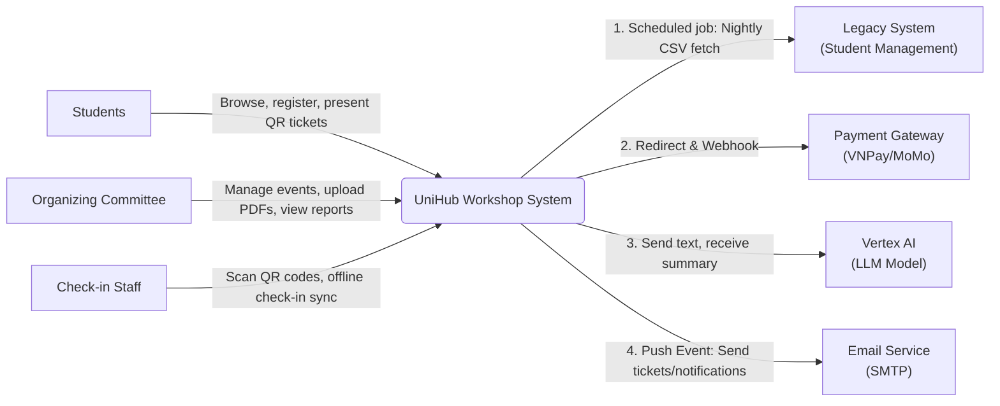
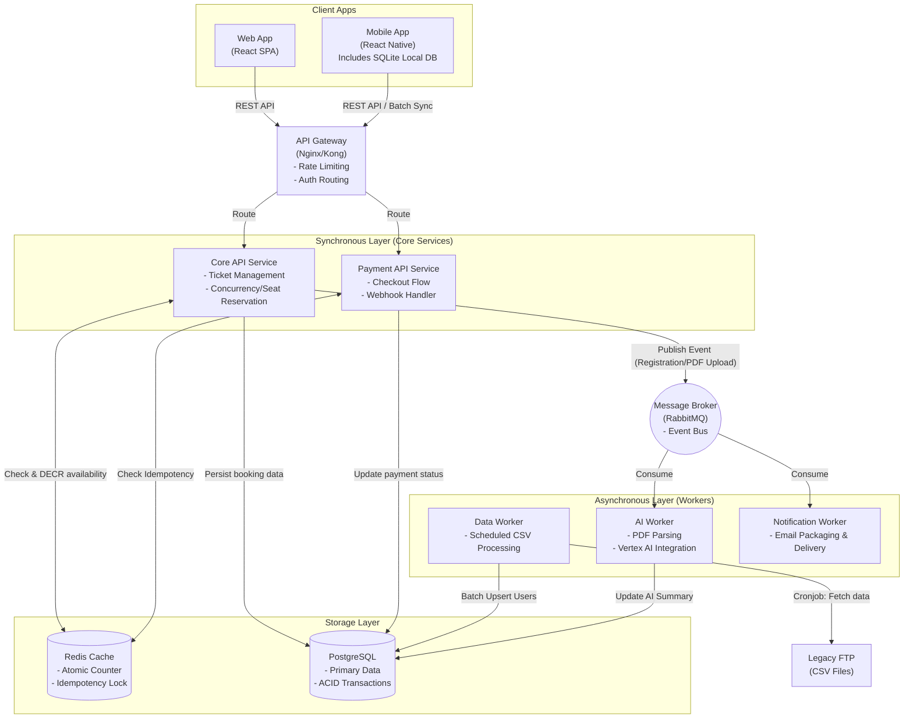
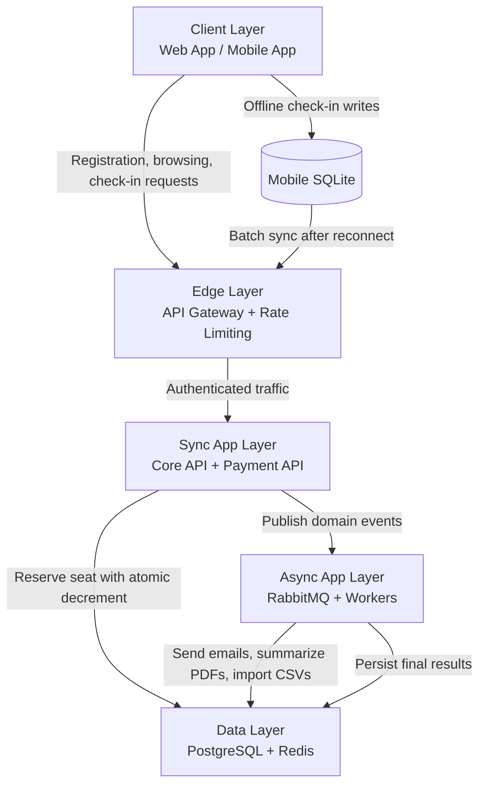
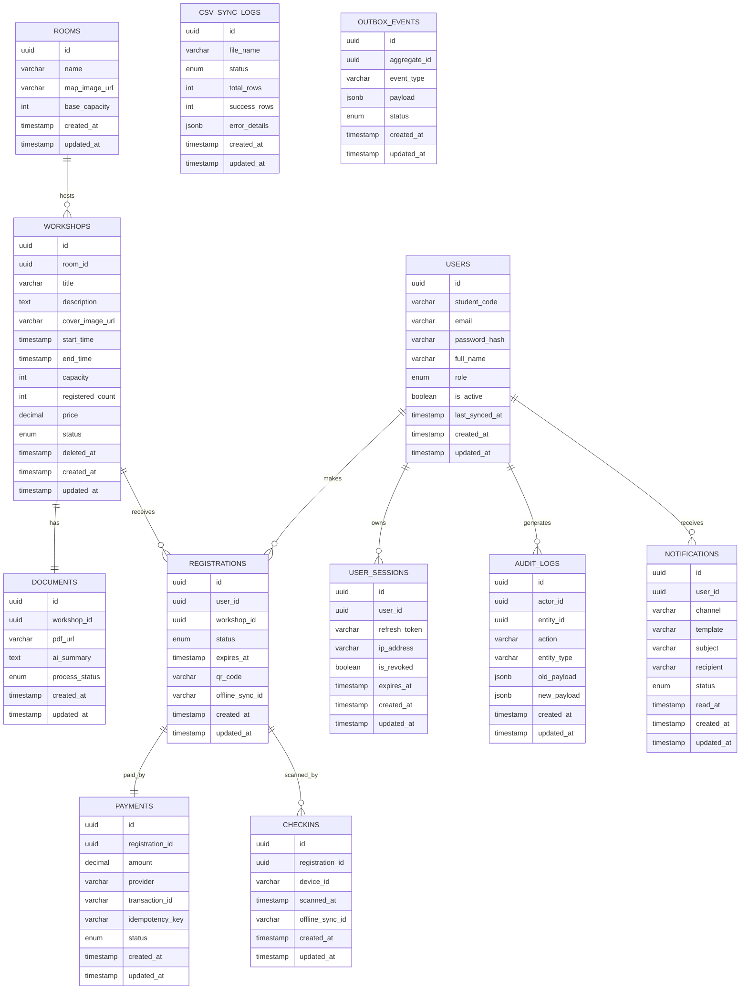
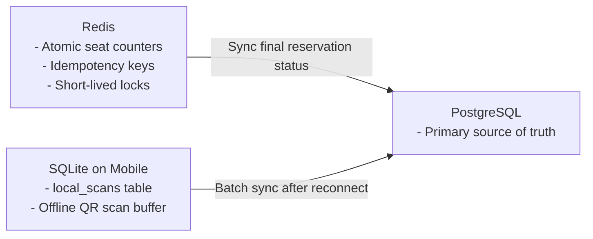
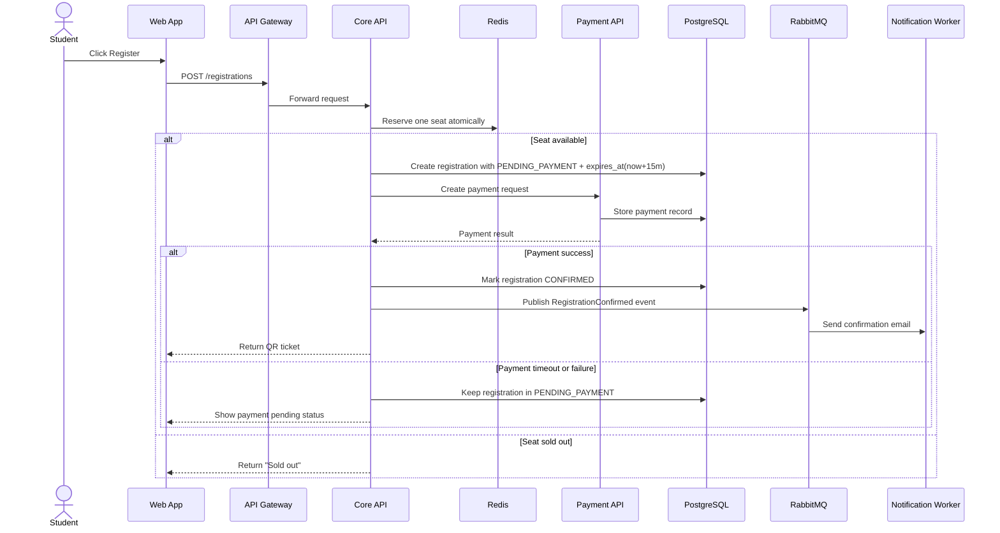
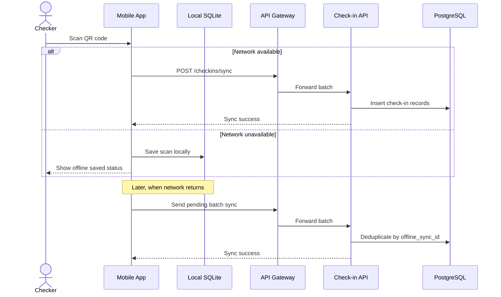
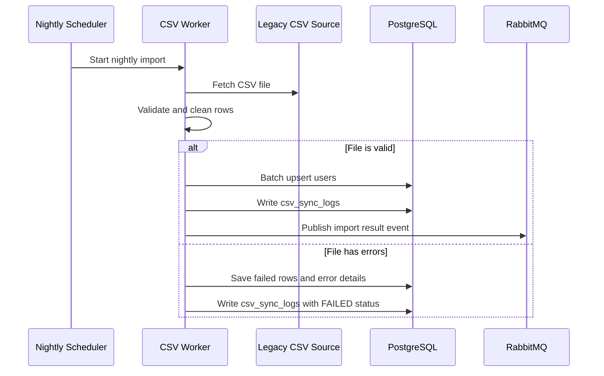

# UniHub Workshop — Technical Design

## Overall Architecture
The system uses an Event-Driven Modular Monolith architecture.

This architecture provides a practical balance between separation of concerns and implementation simplicity. It keeps the core business logic in one codebase, which reduces DevOps overhead and avoids the operational complexity of microservices, while still preserving clear domain boundaries through modules and asynchronous events.

The main components are the API Gateway, the Core API, the Payment API, the message broker, and a set of background workers. The client-facing flows are handled synchronously for immediate feedback, while expensive or slow tasks such as email delivery, AI document summarization, and CSV synchronization are offloaded to asynchronous workers through RabbitMQ.

## Event Definitions

RabbitMQ events are standardized in [events.md](events.md) so the Core API and workers always agree on exchange names, routing keys, and payload structure. The project uses a topic exchange pattern with an outbox-backed publish flow to avoid message loss.

## C4 Diagram

### Level 1 — System Context

### Level 2 — Container

## High-Level Architecture Diagram

The check-in flow is designed to work offline first. When the device loses connectivity, the mobile app stores scan records in local SQLite with generated idempotency identifiers. Once the connection is restored, the app sends a batch sync request to the server. The backend deduplicates records before persisting them to PostgreSQL.

## Database Design
The system uses a polyglot persistence strategy with three storage areas:

- PostgreSQL as the primary transactional database.
- Redis as the in-memory lock and counter store.
- SQLite on mobile devices as the offline local store for scan data.

PostgreSQL is the main source of truth because workshop registration, payment, authorization, and audit data require ACID guarantees, strong consistency, and traceability. All PostgreSQL tables use UUID primary keys and standard audit fields such as `created_at` and `updated_at`.

### Core PostgreSQL Entities and Their Goals

The design is centered on 12 core tables in PostgreSQL:

1. rooms: normalizes physical room information so that room capacity and layout changes can be applied once and reused by multiple workshops.
2. workshops: stores the main event configuration, including time, capacity, pricing, and publication status.
3. documents: separates PDF metadata and AI summaries from workshop browsing traffic so the summary content does not slow down the event list.
4. users: stores identity and authorization data for students, administrators, and staff, and acts as the landing point for legacy CSV synchronization.
5. user_sessions: stores refresh-token session records so the system can revoke suspicious or spammy logins independently of the user account.
6. registrations: represents the ticket or registration record linking a user to a workshop and enforces anti-duplicate booking rules.
7. payments: isolates the financial flow, stores reconciliation data, and protects against double charging through an idempotency key.
8. checkins: stores QR scan history and offline sync payloads received from mobile devices.
9. audit_logs: records who did what and when for dispute handling and administrative transparency.
10. csv_sync_logs: stores the status of nightly legacy CSV imports so operators can review successful and failed rows.
11. outbox_events: stores pending integration events before they are published to RabbitMQ, preventing message loss when the broker is temporarily unavailable.
12. notifications: stores notification delivery records, message content, channel, recipient, and read status for user-facing alerts.

### PostgreSQL Table Structure

The most important columns for each table are summarized below.

- rooms: `name`, `map_image_url`, `base_capacity`.
- workshops: `room_id`, `title`, `description`, `cover_image_url`, `start_time`, `end_time`, `capacity`, `registered_count`, `price`, `status`, `deleted_at`.
- documents: `workshop_id` (unique), `pdf_url`, `ai_summary`, `process_status`.
- users: `student_code` (unique), `email` (unique), `password_hash` (`varchar(255)`, NOT NULL), `full_name`, `role`, `is_active` (default `true`), `last_synced_at`.
- user_sessions: `user_id`, `refresh_token` (unique), `ip_address`, `is_revoked`, `expires_at`.
- registrations: `user_id`, `workshop_id`, `status`, `expires_at` (nullable), `qr_code` (unique), `offline_sync_id`.
- payments: `registration_id` (unique), `amount`, `provider`, `transaction_id`, `idempotency_key` (unique), `status` (`PENDING`, `SUCCESS`, `FAILED`, `REFUNDED`).
- checkins: `registration_id`, `device_id`, `scanned_at`, `offline_sync_id`.
- audit_logs: `actor_id`, `entity_id`, `action`, `entity_type`, `old_payload`, `new_payload`.
- csv_sync_logs: `file_name`, `status`, `total_rows`, `success_rows`, `error_details`.
- outbox_events: `aggregate_id`, `event_type`, `payload`, `status`.
- notifications: `user_id`, `channel`, `template`, `subject`, `recipient`, `status`, `read_at`.

Security and lifecycle notes:

- `users.password_hash` stores only one-way hashes (bcrypt/argon2), never plain-text passwords.
- `users.is_active = false` blocks login and protected API usage without deleting historical data.
- `registrations.expires_at` is used by cron jobs to cancel overdue `PENDING_PAYMENT` holds and release seats.
- `workshops.deleted_at` enables soft delete for canceled/removed workshops while preserving payment and audit traceability.

### ERD Diagram

### Auxiliary Data Stores

Redis is not a relational table. It is used to absorb registration spikes and protect the final seat count with atomic operations. SQLite is also not part of PostgreSQL; it stores `local_scans` on mobile devices until the network is available again.

### Entity Relationships and Business Meaning

#### Core Business:

rooms 1:N workshops: One room can host many workshops over time.

workshops 1:1 documents: Each workshop is linked to one PDF for AI summarization.

users 1:N registrations: A student can sign up for multiple events.

workshops 1:N registrations: A workshop accepts many registrations up to its capacity limit.

registrations 0:1 payments: A registration may or may not have a completed payment record.

registrations 1:N checkins: Full history of QR scans for security and traceability.

#### Technical & Audit:

users 1:N user_sessions: Support for multi-device login sessions.

users 1:N audit_logs: Tracking all sensitive administrative actions.

system 1:N csv_sync_logs: Detached logs to track history and errors of legacy data imports.

transactions 1:N outbox_events: Capturing domain events (e.g., payment_success) for reliable message delivery.

### Indexing Strategy

The following indexes are mandatory for performance and data integrity:

- Unique indexes:
  - `users(student_code)` and `users(email)` prevent duplicate identities during CSV synchronization.
  - `registrations(qr_code)` supports fast QR lookup during check-in.
  - `payments(idempotency_key)` prevents duplicate payment processing.
- Composite unique index:
  - `registrations(user_id, workshop_id)` ensures one user cannot hold two tickets for the same workshop unless the previous registration is cancelled.
- B-tree indexes:
  - `registrations(user_id)` and `registrations(workshop_id)` accelerate joins and ownership queries.
    - `registrations(status, expires_at)` accelerates cron cleanup for expired pending reservations.
    - `users(is_active)` accelerates login/account-state checks.
    - `workshops(status, start_time)` speeds up the public workshop list filtered by publish status and schedule.
    - `workshops(deleted_at)` supports soft-delete filtering (`deleted_at IS NULL`).
    - `payments(status)` supports settlement and refund reconciliation queries.
  - `outbox_events(status)` supports fast polling by background workers.
  - `checkins(offline_sync_id)` avoids duplicate inserts during mobile batch synchronization.

### SQLite Local Table

The mobile app maintains one local table called `local_scans`.

Its purpose is to temporarily store recently scanned QR codes, the actual scan time, and device-generated sync identifiers when the network is unavailable. Once connectivity returns, the app pushes this buffered data to the `checkins` table in PostgreSQL.

### Redis Data Structures

Redis holds two operational structures rather than relational tables:

- a counter structure for seat reservation under burst traffic;
- a lock / idempotency structure for duplicate registration and payment prevention.

These structures exist only for high-speed concurrency control and are always reconciled back to PostgreSQL.

## Suggested Technology Stack

The project uses a JavaScript stack end-to-end: Node.js on the backend, React on the web frontend, and React Native for mobile check-in workflows.

| Layer | Recommended Technology | Purpose | Why It Fits |
|---|---|---|---|
| Frontend Web | React | Student and admin web interface | Large ecosystem, reusable components, and a good fit for dashboard-style screens |
| Frontend Mobile | React Native | Offline-capable check-in app | Supports QR scanning, local SQLite storage, and cross-platform delivery |
| API Gateway | Nginx or Kong | Routing, auth forwarding, rate limiting | Simple to configure and suitable for burst traffic protection |
| Core Backend | Node.js with Express | Workshop, registration, session, and admin APIs | Lightweight, familiar, and easy to keep as a modular monolith |
| Payment Module | Node.js module | Payment orchestration and webhook handling | Fits the same runtime and keeps payment retries and idempotency centralized |
| Background Workers | Node.js worker processes | Email, CSV sync, AI summarization, outbox publishing | Works well with RabbitMQ and asynchronous job processing |
| Database | PostgreSQL | Main transactional storage | Strong ACID guarantees for registrations, payments, and audit logs |
| Cache / Lock Store | Redis | Seat counters, locks, idempotency keys | Fast atomic operations for race-condition prevention |
| Message Broker | RabbitMQ | Event delivery to workers | Reliable queue-based communication for the modular monolith |
| Mobile Local Store | SQLite | Offline scan buffering | Keeps check-in data safe during weak or lost connectivity |
| AI Integration | Vertex AI API | PDF summarization | Avoids building and hosting a custom model |
| Notification Service | SendGrid or SMTP provider | Email delivery | Easy to integrate and reliable for confirmation messages |
| Containerization | Docker and Docker Compose | Local development and demo environment | Matches the project scope and keeps setup reproducible |

### Suggested Project Libraries

| Concern | Node.js / JavaScript Stack |
|---|---|
| REST API | Express |
| Validation | Zod or Joi |
| Query Builder + Migrations | Knex.js |
| Security | Passport JWT or custom middleware |
| Messaging | amqplib or a RabbitMQ wrapper |
| Cache | ioredis |
| Database Migration | Knex migrations |
| Testing | Jest + Supertest |
| PDF Processing | pdf-parse or pdf-lib |
| QR Generation / Scanning | qrcode and mobile camera libraries |

| Deployment Concern | Suggested Tooling |
|---|---|
| Local orchestration | Docker Compose |
| Logs and troubleshooting | Structured JSON logs |
| Config management | Environment variables and `.env` files |
| CI validation | Unit tests, integration tests, linting, and migration checks |

### Mobile Technology Stack (React Native)

The mobile check-in app is built with React Native to support offline QR scanning and background synchronization. The stack prioritizes performance and reliable offline-first behavior.

| Concern | Recommended Library | Purpose |
|---|---|---|
| **Framework** | React Native 0.72+ | Cross-platform mobile app for iOS and Android |
| **Local Database** | WatermelonDB | Offline-first, reactive local storage optimized for thousands of records |
| **QR Code Scanning** | react-native-camera or react-native-vision-camera | Camera integration and QR code detection |
| **Network State** | @react-native-community/netinfo | Detect online/offline transitions and connection quality |
| **Background Tasks** | react-native-background-fetch | Scheduled background sync without full app activation |
| **Local Preferences** | @react-native-async-storage/async-storage | Store app settings and sync metadata |
| **HTTP Client** | axios or native fetch | API calls to backend `/checkins/sync` endpoint |
| **State Management** | Zustand or Redux Toolkit | Global sync status and offline indicators |
| **UI Kit** | React Native Paper or Tamagui | Accessible, themed components for consistent UX |
| **Date Handling** | date-fns or day.js | Parse and format timestamps for sync payloads |
| **Testing** | Jest + @testing-library/react-native | Unit tests for database and sync logic |

**Sync Strategy:**
- **Foreground Sync:** Triggered automatically when network transitions from offline to online; shows real-time sync status.
- **Background Sync:** Runs every 10 minutes via `react-native-background-fetch` to ensure pending scans reach the server.
- **Manual Sync:** Users can tap "Sync Now" to force immediate synchronization.

For detailed offline implementation and sync payload structure, see [checkin.md](specs/checkin.md#react-native-mobile-implementation).

## Access Control Design
The system uses Role-Based Access Control with three primary roles. JWT is used for authentication, while authorization is enforced at both the API Gateway and the application layer.

### Role and Permission Matrix

| Role | Main Capabilities | Protected Resources |
|---|---|---|
| Student | View workshops, register, pay, receive QR tickets, and view personal check-in history | Public workshop APIs, personal registration APIs, payment status APIs |
| Admin | Create, update, cancel workshops, upload PDFs, review statistics, and process CSV sync results | Admin dashboard, workshop management APIs, document upload APIs, analytics APIs |
| Checker | Scan QR codes, submit offline check-in batches, and view only today’s scan status | Mobile sync endpoint, check-in APIs |

### Authentication and Authorization Flow

1. The user signs in and receives a JWT access token and a refresh token.
2. The API Gateway verifies the JWT signature, expiration time, issuer, and audience.
3. The Gateway forwards only valid requests to the Core API.
4. The Core API reads the role claim and checks it against the endpoint policy.
5. The application layer performs a second authorization check for sensitive actions such as payment confirmation, workshop cancellation, and offline batch sync.

This double-check approach prevents a compromised client from calling privileged endpoints directly.

### Endpoint-Level Access Rules

| Endpoint Group | Allowed Roles | Notes |
|---|---|---|
| `GET /workshops`, `GET /workshops/{id}` | Student, Admin, Checker | Public browsing data is available to all authenticated users |
| `POST /registrations`, `GET /registrations/me` | Student | Students can register only for themselves |
| `POST /payments/webhook`, `GET /payments/me` | Student, Admin | Webhooks are validated separately by signature and idempotency key |
| `POST /admin/workshops`, `PUT /admin/workshops/{id}`, `DELETE /admin/workshops/{id}` | Admin | Full workshop management is restricted to internal staff |
| `POST /admin/documents` | Admin | PDF upload and AI summarization triggers |
| `POST /checkins/sync` | Checker | Only the mobile check-in app can submit scan batches |
| `GET /admin/stats`, `GET /admin/csv-sync-logs` | Admin | Reporting and operational monitoring |

### Enforcement at Each Access Point

| Access Point | Enforcement Method | Behavior |
|---|---|---|
| API Endpoint | JWT + role claim + endpoint policy | Rejects unauthorized requests with HTTP 401 or 403 |
| Admin Web UI | Route guards and server-side permission checks | Hides admin pages from unauthorized users and blocks direct URL access |
| Mobile App | Device login + role restriction + offline sync token | Only checker accounts can use scan and sync screens |

For the mobile app, the checker role is the only role allowed to store offline scans and upload them later. For the admin web UI, protected pages are hidden by route guards, but the server still validates every request so that UI hiding alone is not considered security.

## Business Workflow Design

This section describes the three most important business flows in the system. Each flow shows the main participants, the processing steps, and how the system behaves when an error occurs in the middle of execution.

### 1. Paid Workshop Registration Flow

This flow starts when a student clicks Register and ends when the QR ticket is issued.

If an error happens midway, the system does not lose the seat state. Redis is used first for reservation control, and PostgreSQL is updated only after the reservation step succeeds. If payment fails, the system keeps the booking in a pending state with `expires_at` instead of issuing a false confirmation. A scheduled cleanup job cancels overdue pending registrations and restores seat availability.

### 2. Offline Check-in and Sync Flow

This flow starts when staff scans a QR code in a weak-signal area and ends when the scan record is synchronized back to the server.

If connectivity is lost, the app keeps the scan in SQLite instead of dropping it. When the network comes back, the app sends the stored batch to the server, and the backend removes duplicates using the offline sync identifier.

### 3. Nightly CSV Import Flow

This flow imports legacy student data from the old system without stopping the live application.

If the CSV file contains duplicates or invalid rows, the worker isolates the bad rows and continues processing the valid ones. This keeps the import from interrupting the rest of the system.

## System Protection Mechanisms

The system protection layer focuses on three business risks: traffic spikes, unstable payment partners, and duplicate payment execution.

### Spike Traffic Control
The system must handle 12,000 students within the first 10 minutes of registration, with 60 percent of the traffic concentrated in the first 3 minutes.

The API Gateway applies a Token Bucket rate limiter because the burst pattern is high at the beginning of registration and then falls quickly. Token Bucket is a better fit than Fixed Window because it allows short bursts while still enforcing a long-term average.

| Item | Design Choice |
|---|---|
| Algorithm | Token Bucket |
| Control Point | API Gateway |
| Suggested Threshold | 5 requests per second per user or IP |
| Burst Behavior | Short bursts are allowed when tokens are available |
| Failure Response | HTTP 429 Too Many Requests |
| Frontend Behavior | Show a retry message instead of re-sending requests aggressively |

Requests that exceed the threshold are rejected before they reach the Core API, which protects the database connection pool and keeps the registration flow fair for all users.

### Unstable Payment Gateway Handling
Payment partners may time out or become temporarily unavailable.

The system uses a Circuit Breaker combined with Graceful Degradation. This protects the main registration flow from being blocked by an external payment outage.

| Circuit State | Trigger | Behavior |
|---|---|---|
| Closed | Normal operation | Requests flow to the payment provider normally |
| Open | Failure or timeout rate exceeds 50 percent within 1 minute | Stop sending payment requests to the external gateway |
| Half-Open | After 5 minutes | Send a small number of probe requests to test recovery |

When the circuit is open, the system does not stop browsing or registration completely. Instead, it creates a pending registration state and allows the student to finish payment later. This keeps the rest of the application usable even when the payment partner is down.

| Graceful Degradation Action | Result |
|---|---|
| Create registration in `PENDING_PAYMENT` + `expires_at` | Seat is reserved temporarily and can be auto-released after timeout |
| Notify the student | Student knows payment must be retried later |
| Continue non-payment features | Browsing, event details, and admin functions remain available |

### Double-Charge Prevention
To prevent duplicate payment processing, the system uses an Idempotency Key mechanism.

| Item | Design Choice |
|---|---|
| Key Source | UUID generated by the client or payment initiation service |
| Storage | Redis |
| TTL | 24 hours |
| Purpose | Prevent the same payment request from being processed more than once |

Processing flow:

1. The client generates or sends an idempotency key when starting payment.
2. The backend checks Redis to see whether the key already exists.
3. If the key does not exist, the backend stores it and processes the payment.
4. If the payment succeeds, the backend updates the payment record in PostgreSQL and issues the QR ticket.
5. If the same request is retried, the backend returns the previous successful result and skips duplicate processing.

This design prevents double charging even if the client retries due to timeout, unstable network, or repeated webhook delivery from the payment provider.

## Local Development & Deployment Infrastructure

For detailed setup instructions, environment variables, Docker Compose configuration, and service orchestration, see [infrastructure.md](infrastructure.md).

**Quick Reference:**
- All services run in Docker containers via `docker-compose up -d`
- PostgreSQL, Redis, RabbitMQ, and backend API are containerized
- Environment variables are managed in `.env` (template provided in `.env.example`)
- Mock payment keys enable testing without real charges
- Health endpoints available at `/api/health` to verify all services are connected

## Important Technical Decisions (ADR)

### ADR 1: Event-Driven Modular Monolith instead of Microservices
Decision: keep the Core API and Payment API in one codebase, while using RabbitMQ to separate asynchronous work into workers.

Reason: this keeps domain boundaries clear without introducing the coordination and deployment overhead of a full microservices system. It is a better fit for a small team and supports faster delivery.

Trade-off: individual modules cannot be scaled completely independently, so the whole core application block must scale together.

### ADR 2: PostgreSQL plus Redis instead of a pure NoSQL stack
Decision: use PostgreSQL as the primary database and Redis as the lock and cache layer.

Reason: registration and payment data require ACID guarantees and reliable transactional behavior. Redis is used only where fast atomic operations and short-lived state are needed.

Trade-off: the deployment and operational model becomes slightly more complex because two storage technologies must be managed.

### ADR 3: Vertex AI API instead of training an internal LLM
Decision: use Vertex AI to summarize uploaded workshop PDFs.

Reason: this satisfies the automation requirement quickly and avoids the cost and complexity of training and operating a custom model.

Trade-off: the system depends on an external API and incurs ongoing usage costs, but these are acceptable for a blueprint-level and container-based project.