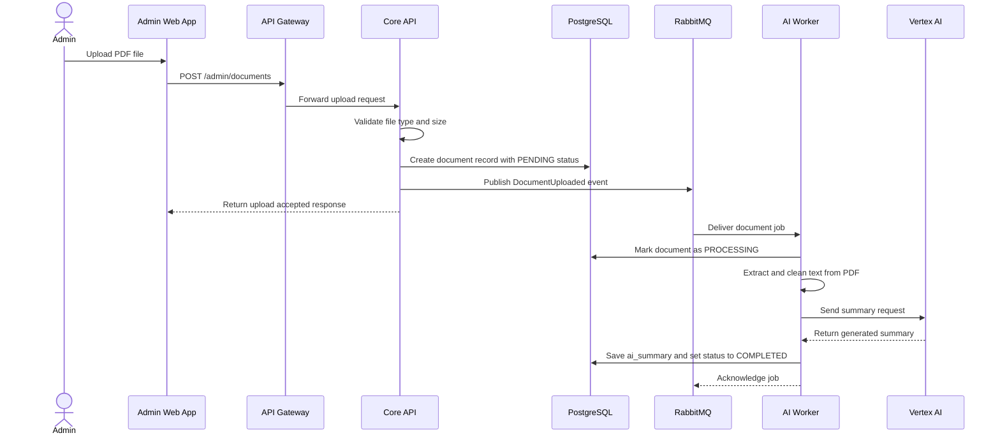

# Specification: AI Summary Feature

## Description
This feature allows the Organizing Committee to upload a workshop PDF and receive an AI-generated summary that is displayed on the workshop detail page.

The AI summary flow is asynchronous by design. The web request only validates the file, stores the document metadata, and enqueues a background job. The actual text extraction and AI generation are handled by the AI Worker so that large PDF files do not block the main API or freeze the user experience.

The feature is intended to work safely even when the uploaded PDF is large, when the AI provider is slow, or when the external AI API temporarily fails.

## API Surface

| Method | Endpoint | Purpose |
|---|---|---|
| POST | `/admin/documents` | Upload a PDF for AI summarization |
| GET | `/admin/documents/{id}` | Check document summary status |

## Main Flow

Step-by-step behavior:

1. The admin uploads a PDF from the workshop management screen.
2. The API Gateway forwards the request to the Core API after authentication and authorization checks.
3. The Core API validates that the file is a PDF and that its size is within the configured limit.
4. The Core API stores the document metadata in PostgreSQL with status `PENDING`.
5. The Core API publishes a `DocumentUploaded` event to RabbitMQ.
6. The AI Worker consumes the event, extracts text from the PDF, and calls Vertex AI.
7. The AI Worker stores the generated summary back in PostgreSQL and marks the document as `COMPLETED`.
8. The workshop detail page reads the summary from the database and displays it to users.

## Error Scenarios

### 1. File is too large or invalid
If the uploaded file is not a PDF or exceeds the configured size limit, the Core API rejects the upload immediately and returns an error response.

Expected behavior:

- The document record is not created.
- No job is sent to RabbitMQ.
- The admin sees a clear validation message.

### 2. Upload succeeds but the AI Worker fails later
If the file is accepted but the worker crashes, the system keeps the document record in `PENDING` or `PROCESSING` state.

Expected behavior:

- The main application remains responsive.
- The failed job can be retried safely.
- The admin can see that the summary is still being processed.

### 3. Vertex AI times out or returns an error
If the external AI API is slow or unavailable, the worker retries the request according to the configured retry policy.

Expected behavior:

- Temporary failures do not affect browsing or registration features.
- The document status remains `PROCESSING` during retries.
- After the retry limit is reached, the status becomes `FAILED` and the admin can re-run the job later.

### 4. RabbitMQ is temporarily unavailable
If the event cannot be published to RabbitMQ after the document record is created, the system must not lose the upload metadata.

Expected behavior:

- The document record remains stored in PostgreSQL.
- The system writes the event to the outbox so it can be published later.
- No summary is generated until the event is delivered successfully.

## Constraints

| Constraint | Requirement |
|---|---|
| Processing mode | The summary generation must be asynchronous, not synchronous |
| File handling | The Core API must not load the entire PDF into memory at once |
| Maximum upload size | The system must enforce a configured PDF size limit, such as 50 MB |
| Status tracking | Each document must move through `PENDING`, `PROCESSING`, `COMPLETED`, or `FAILED` |
| Reliability | Upload metadata must be preserved even if RabbitMQ or Vertex AI fails |
| Security | Only authorized admin users can upload workshop documents |
| User experience | The admin receives an immediate response after the upload is accepted |

## Acceptance Criteria

- The admin can upload a valid PDF and receive an immediate accepted response.
- The system stores the document metadata before AI processing starts.
- The AI summary is generated by a background worker, not by the web request thread.
- Large PDFs do not block the main API or crash the server.
- If Vertex AI times out, the job is retried and the document status reflects the failure state correctly.
- If RabbitMQ is temporarily unavailable, the document metadata is still preserved and the job can be published later.
- The generated summary appears on the workshop detail page after processing completes.
