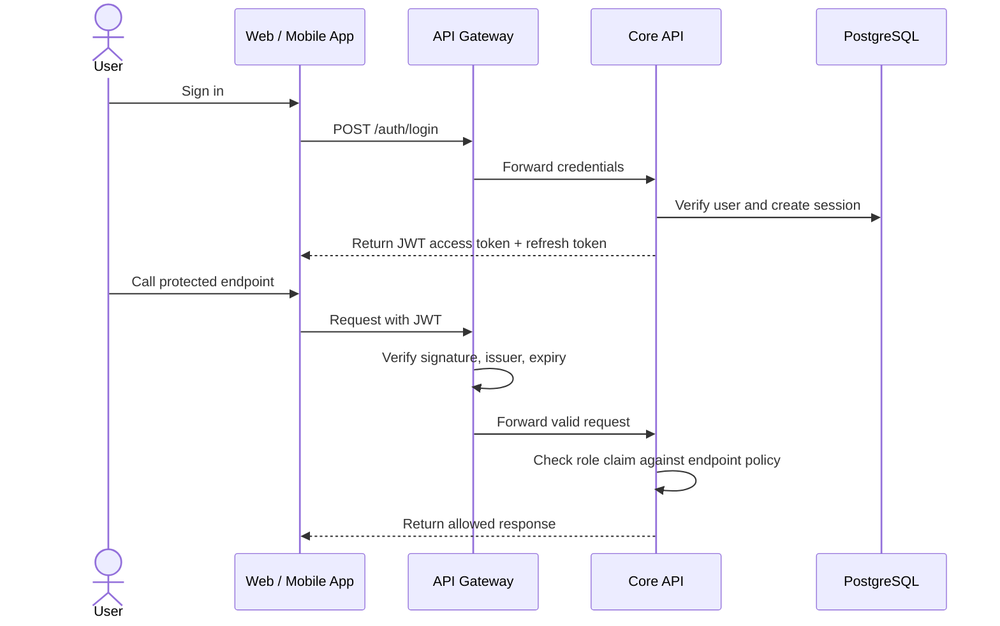

# Specification: Authentication and Authorization (Auth & RBAC)

## Description
This feature defines how users authenticate and how the system authorizes access for the three roles: Student, Organizing Committee, and Staff.

Authentication is based on JWT access tokens and refresh tokens stored in the `user_sessions` table. Authorization is based on Role-Based Access Control (RBAC) and is enforced at both the API Gateway and the Core API.

The feature also covers session revocation and account lockout behavior when suspicious activity is detected.

## Main Flow

Step-by-step behavior:

1. The user signs in with valid credentials.
2. The Core API verifies the account and creates a session record in `user_sessions`.
3. The API Gateway validates the JWT before forwarding requests.
4. The Core API checks the role claim and endpoint permissions.
5. If the request is allowed, the operation continues; otherwise, the system returns a forbidden response.

## Error Scenarios

### 1. Invalid or expired token
If the JWT is missing, invalid, expired, or signed incorrectly, the API Gateway rejects the request before it reaches the Core API.

Expected behavior:

- Return HTTP 401 Unauthorized.
- Do not call internal business logic.
- Ask the user to sign in again.

### 2. Role mismatch
If a user tries to access an endpoint outside their role, the Core API blocks the request.

Expected behavior:

- Return HTTP 403 Forbidden.
- Do not leak privileged data.
- Log the event for audit purposes.

### 3. Session revoked or locked out
If the account is marked as revoked in `user_sessions`, the system must prevent further use of the refresh token.

Expected behavior:

- Reject refresh-token renewal.
- Force the user to sign in again.
- Keep the lockout state until an administrator or security rule clears it.

## Constraints

| Constraint | Requirement |
|---|---|
| Authentication mode | JWT access token + refresh token |
| Authorization model | RBAC with Student, Admin, and Checker roles |
| Enforcement points | API Gateway and Core API |
| Session control | Session revocation must be stored in `user_sessions` |
| Security | Protected endpoints must reject unauthorized requests by default |
| Auditability | Sensitive actions should be traceable |

## Acceptance Criteria

- A valid user can sign in and receive a JWT.
- Invalid or expired tokens are rejected at the API Gateway.
- The Core API blocks role violations with HTTP 403.
- Revoked sessions cannot be reused to refresh tokens.
- Students, admins, and checkers can only access the endpoints allowed for their role.
