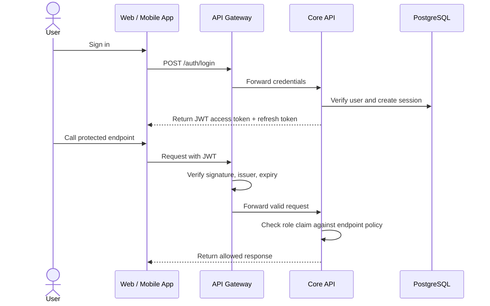

# Specification: Authentication and Authorization (Auth & RBAC)

## Description
This feature defines how users authenticate and how the system authorizes access for the three roles: Student, Admin, and Checker.

Authentication is based on JWT access tokens and refresh tokens stored in the `user_sessions` table. Login uses **email** as the unique identifier and verifies passwords against `users.password_hash` (bcrypt hash, never plain-text). Inactive users are blocked through `users.is_active`. Authorization is based on Role-Based Access Control (RBAC) and is enforced at the Core API level.

The feature also covers session revocation and account lockout behavior when suspicious activity is detected.

## API Surface

| Method | Endpoint | Purpose |
|---|---|---|
| POST | `/auth/login` | Sign in and issue JWT access/refresh tokens |
| POST | `/auth/refresh` | Refresh an access token |
| POST | `/auth/logout` | Revoke the current session |
| GET | `/auth/me` | Return the current user profile |

## Main Flow



Step-by-step behavior:

1. The user signs in with valid credentials.
2. The Core API loads the user and compares `password` with `users.password_hash`.
3. The Core API checks `users.is_active`; if false, login is rejected.
4. If valid and active, the Core API creates a session record in `user_sessions`.
5. The API Gateway validates the JWT before forwarding requests.
6. The Core API checks the role claim and endpoint permissions.
7. If the request is allowed, the operation continues; otherwise, the system returns a forbidden response.

## Error Scenarios

### 1. Invalid or expired token
If the JWT is missing, invalid, expired, or signed incorrectly, the API Gateway rejects the request before it reaches the Core API.

Expected behavior:

- Return HTTP 401 Unauthorized.
- Do not call internal business logic.
- Ask the user to sign in again.

### 2. Role mismatch
If a user tries to access an endpoint outside their role, the Core API blocks the request.

Expected behavior:

- Return HTTP 403 Forbidden.
- Do not leak privileged data.
- Log the event for audit purposes.

### 3. Session revoked or locked out
If the account is marked as revoked in `user_sessions`, the system must prevent further use of the refresh token.

Expected behavior:

- Reject refresh-token renewal.
- Force the user to sign in again.
- Keep the lockout state until an administrator or security rule clears it.

### 4. Inactive account
If a user is deactivated (`users.is_active = false`) by CSV sync or admin action, authentication and token refresh must be blocked.

Expected behavior:

- Return HTTP 403 Forbidden.
- Do not create new sessions.
- Keep existing historical records (registrations, payments, audit logs).

### 5. Invalid password
If a password does not match `users.password_hash`, the authentication attempt fails.

Expected behavior:

- Return HTTP 401 Unauthorized.
- Do not reveal whether the username exists.
- Log failed attempts for monitoring.

## Constraints

| Constraint | Requirement |
|---|---|
| Authentication mode | JWT access token + refresh token (refresh token in HttpOnly cookie) |
| Login identifier | Email (unique field in `users` table) |
| Authorization model | RBAC with Student, Admin, and Checker roles |
| Enforcement points | Core API (validates every request server-side) |
| Session control | Session revocation stored in `user_sessions.is_revoked` |
| Password storage | `users.password_hash` must store bcrypt hashes only (never plain-text) |
| Account status | `users.is_active = false` must block login and token refresh |
| Security | Protected endpoints must reject unauthorized requests by default |
| Rate limiting | Login: 5/15min, Register: 3/60min, Refresh: 10/15min per IP |
| Token expiry | Access: 1 hour, Refresh: 30 days |
| Auditability | Sensitive actions should be traceable (session creation, logout, password changes) |

## Acceptance Criteria

- A valid user can sign in with email and receive a JWT access token.
- Password validation uses `users.password_hash` only (bcrypt comparison).
- Inactive users (`is_active = false`) cannot sign in or refresh tokens.
- Invalid or expired tokens are rejected with HTTP 401 and appropriate error code.
- The Core API blocks role violations with HTTP 403.
- Revoked sessions cannot be reused to refresh tokens (is_revoked flag checked).
- Students, admins, and checkers can only access endpoints matching their role.
- Refresh token is stored in HttpOnly cookie (secure, no JavaScript access).
- Rate limiting prevents brute force attacks on login/register endpoints.
- Password changes revoke all active sessions (force re-login).
- Email addresses are unique and used as login identifier.
- Response format includes status, message, code, and data fields.

## Implementation Details

### Login Request
- **Identifier**: Email (not username) - email field is unique in users table
- **Password**: Plain text sent over HTTPS only
- **Response**: Includes accessToken (in JSON), refreshToken (in HttpOnly cookie), and user profile

### Token Lifecycle
1. **Access Token (JWT)**
   - Expiry: 1 hour
   - Contains: `id`, `role`, `type: 'access'`
   - Storage: Client localStorage/sessionStorage
   - Usage: Include in `Authorization: Bearer <token>` header
   - Verified on each protected request

2. **Refresh Token (JWT)**
   - Expiry: 30 days
   - Contains: `id`, `role`, `type: 'refresh'`
   - Storage: HttpOnly, Secure, SameSite=Strict cookie
   - Validation: Cross-checked against `user_sessions` table
   - Revocation: `user_sessions.is_revoked = true` prevents reuse

### Response Format
All API responses follow this structure:
```json
{
  "status": "SUCCESS|ERROR",
  "message": "Human-readable message",
  "code": "ERROR_CODE (on errors only)",
  "data": { ... }
}
```

### Protected Endpoint Access
- All protected endpoints require `Authorization: Bearer <accessToken>` header
- If token is expired or invalid, return 401 with appropriate error code
- Client should use refresh endpoint to get new access token
- If refresh fails, redirect user to login

### Session Management
- Each login creates new record in `user_sessions`
- Session stores: `refresh_token`, `ip_address`, `expires_at`, `is_revoked` flag
- Logout revokes session by setting `is_revoked = true`
- Password change revokes ALL sessions for the user
- Expired sessions can be cleaned up periodically

### Rate Limiting
- Implemented per IP + endpoint path
- Login: 5 attempts / 15 minutes → 429 RATE_LIMIT_EXCEEDED
- Register: 3 attempts / 60 minutes → 429 RATE_LIMIT_EXCEEDED
- Refresh: 10 attempts / 15 minutes → 429 RATE_LIMIT_EXCEEDED
- Client should wait and retry after HTTP 429 response
