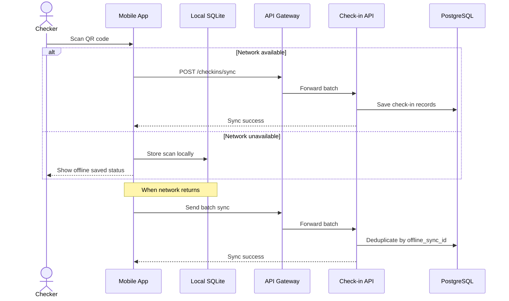

# Specification: Offline Check-in (Local-First Sync)

## Description
This feature allows check-in staff to scan QR codes at the venue even when the network is unstable or completely unavailable.

The mobile app stores scan records in local SQLite first. When connectivity returns, it sends a batch sync request to the backend. The backend deduplicates the data using `offline_sync_id` before writing the final records to PostgreSQL.

## API Surface

| Method | Endpoint | Purpose |
|---|---|---|
| POST | `/checkins/sync` | Sync offline or online QR scans |
| GET | `/checkins/me` | View my check-in history |
| GET | `/admin/checkins` | View check-in statistics |

## Main Flow



Step-by-step behavior:

1. The checker scans a student QR code.
2. If the network is available, the app sends the scan immediately to the server.
3. If the network is unavailable, the app stores the scan in SQLite.
4. When the network returns, the app submits the stored batch.
5. The backend filters duplicates using `offline_sync_id`.
6. The final check-in history is written to PostgreSQL.

## Error Scenarios

### 1. Network outage during scanning
If the venue has no connectivity, the app must not lose the scan.

Expected behavior:

- Save the scan locally.
- Show the user that the scan was stored offline.
- Retry synchronization later.

### 2. Duplicate batch submission
If the same batch is uploaded more than once, the backend must not create duplicate check-in records.

Expected behavior:

- Use `offline_sync_id` to deduplicate.
- Keep the earliest valid scan record.
- Ignore repeated uploads safely.

### 3. Sync failure after reconnect
If the network returns but the sync request fails, the app must keep the local data until the next retry.

Expected behavior:

- Preserve local SQLite records.
- Retry batch sync later.
- Do not delete local data until the server confirms success.

## Constraints

| Constraint | Requirement |
|---|---|
| Offline-first | Scans must be stored locally when offline |
| Sync safety | No data loss after connectivity is restored |
| Deduplication | Use `offline_sync_id` on PostgreSQL |
| Local storage | Use SQLite on mobile devices |
| UX | Staff should see immediate offline feedback |
| Reliability | Failed syncs must not delete local records |

## Acceptance Criteria

- A scan can be stored locally when the network is unavailable.
- The same scan batch can be re-sent safely without duplicates.
- Check-in records are eventually persisted to PostgreSQL.
- The app continues to work during connectivity loss.
- Offline data is not deleted before successful synchronization.

## React Native Mobile Implementation

This section details the technology choices and architectural decisions for the mobile check-in app built with React Native.

### Local Database: WatermelonDB

**Library Choice: WatermelonDB** (not `react-native-sqlite-storage`)

**Reason:**
- WatermelonDB is a lightweight, reactive database specifically optimized for React Native apps.
- Handles thousands of offline records with minimal lag or memory overhead.
- Provides automatic reactive updates via observables, so the UI re-renders only when relevant data changes.
- Has built-in lazy loading and indexing for efficient querying of large scan datasets.
- Supports background sync and works well with the offline-first pattern.

**Installation:**
```bash
npm install @nozbe/watermelondb @nozbe/with-observables
npx react-native link @nozbe/watermelondb
```

**Schema Example:**
```javascript
// schema.js
import { appSchema, tableSchema } from '@nozbe/watermelondb';

export const schema = appSchema({
  version: 1,
  tables: [
    tableSchema({
      name: 'checkins',
      columns: [
        { name: 'qr_code', type: 'string' },
        { name: 'scanned_at', type: 'number' }, // Unix timestamp
        { name: 'offline_sync_id', type: 'string', isIndexed: true },
        { name: 'sync_status', type: 'string' }, // 'PENDING', 'SYNCED', 'FAILED'
        { name: 'created_at', type: 'number' },
        { name: 'updated_at', type: 'number' }
      ]
    })
  ]
});
```

### Background Synchronization Strategy

**Sync Trigger Modes:**

| Mode | When | Mechanism | Use Case |
|---|---|---|---|
| **Foreground Sync** | App is active and in focus | Automatic sync when network state changes (online/offline transitions) | Immediate feedback when connection is restored; scanned QRs sync quickly |
| **Background Sync (Scheduled)** | App is backgrounded | `react-native-background-job` on Android; `react-native-background-fetch` on iOS | Periodic sync every 5-10 minutes while app is in background |
| **Background Sync (On Boot)** | Device reboots or app restarts | Trigger sync on app initialization | Ensure pending scans are synced as soon as the app launches |

**Recommended Implementation:**

1. **Foreground Sync (Primary):**
   - Use `@react-native-community/netinfo` to listen to network state changes.
   - When transition from offline to online is detected, trigger an immediate batch sync.
   - Show a banner or toast to the user indicating "Syncing offline data...".

2. **Background Sync (Secondary):**
   - Use `react-native-background-fetch` (iOS) or a work scheduler (Android).
   - Schedule a sync job every 10 minutes to ensure data is pushed even if the app is in the background.
   - If sync succeeds, disable the banner; if it fails, keep the "Offline" indicator visible.

3. **On-Demand Sync:**
   - Provide a manual "Sync Now" button for users who want to force synchronization.
   - Useful for staff who know they're about to leave the venue.

### Mobile Library Stack

| Concern | Recommended Library | Purpose |
|---|---|---|
| **Local Database** | WatermelonDB | Offline-first, reactive local storage optimized for React Native |
| **QR Code Scanning** | `react-native-camera` or `react-native-vision-camera` | Camera access and QR code detection via native libraries |
| **Network State Detection** | `@react-native-community/netinfo` | Detect online/offline transitions and connection quality |
| **Background Tasks** | `react-native-background-fetch` (iOS/Android) | Scheduled background sync without waking the full app |
| **Async Storage** | `@react-native-async-storage/async-storage` | Store app preferences (e.g., last sync timestamp, user settings) |
| **HTTP Client** | `axios` or `fetch` (native) | API calls to the backend |
| **State Management** | Zustand or Redux Toolkit | Global state for offline sync status, UI indicators |
| **UI Components** | React Native Paper or Tamagui | Consistent, accessible button and card components |
| **Date/Time** | `date-fns` or `moment-timezone` | Parse and format timestamps for sync requests and local display |
| **Testing** | Jest + `@testing-library/react-native` | Unit and integration tests for database and sync logic |

### Sync Payload Structure

When the app sends a batch sync request to the server:

```json
{
  "device_id": "android-6d9f1f0c",
  "app_version": "1.2.3",
  "last_sync_at": "2026-04-30T08:00:00Z",
  "scans": [
    {
      "qr_code": "UNI-REG-2026-000123",
      "scanned_at": "2026-04-30T09:15:22Z",
      "offline_sync_id": "d6f0c7df-8e6c-41c1-9d9f-1af1f1a8f00a"
    },
    {
      "qr_code": "UNI-REG-2026-000124",
      "scanned_at": "2026-04-30T09:15:31Z",
      "offline_sync_id": "d6f0c7df-8e6c-41c1-9d9f-1af1f1a8f00b"
    }
  ]
}
```

### Error Recovery

- **Sync Request Fails:** Log the failure in WatermelonDB, mark scans as `FAILED`, and retry on the next sync window.
- **Partial Sync:** If some scans succeed and others fail, the server returns which `offline_sync_id` values were accepted. The app updates WatermelonDB status accordingly.
- **Stale Data:** If the app has been offline for more than 7 days, alert the user that older scans may be discarded by the server to prevent data pollution.

### Data Cleanup

- After a successful sync, mark scans as `SYNCED` in WatermelonDB (do not delete immediately).
- Periodically archive or delete scans older than 30 days to prevent database bloat.
- On explicit user request ("Clear All Synced Data"), delete only `SYNCED` records.
