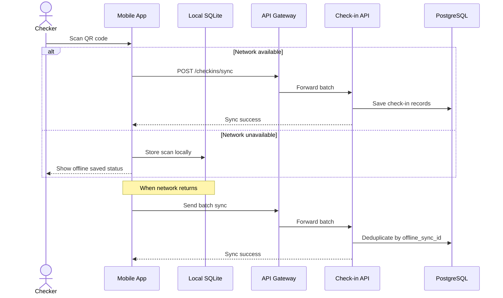

# Specification: Offline Check-in (Local-First Sync)

## Description
This feature allows check-in staff to scan QR codes at the venue even when the network is unstable or completely unavailable.

The mobile app stores scan records in local SQLite first. When connectivity returns, it sends a batch sync request to the backend. The backend deduplicates the data using `offline_sync_id` before writing the final records to PostgreSQL.

## Main Flow

Step-by-step behavior:

1. The checker scans a student QR code.
2. If the network is available, the app sends the scan immediately to the server.
3. If the network is unavailable, the app stores the scan in SQLite.
4. When the network returns, the app submits the stored batch.
5. The backend filters duplicates using `offline_sync_id`.
6. The final check-in history is written to PostgreSQL.

## Error Scenarios

### 1. Network outage during scanning
If the venue has no connectivity, the app must not lose the scan.

Expected behavior:

- Save the scan locally.
- Show the user that the scan was stored offline.
- Retry synchronization later.

### 2. Duplicate batch submission
If the same batch is uploaded more than once, the backend must not create duplicate check-in records.

Expected behavior:

- Use `offline_sync_id` to deduplicate.
- Keep the earliest valid scan record.
- Ignore repeated uploads safely.

### 3. Sync failure after reconnect
If the network returns but the sync request fails, the app must keep the local data until the next retry.

Expected behavior:

- Preserve local SQLite records.
- Retry batch sync later.
- Do not delete local data until the server confirms success.

## Constraints

| Constraint | Requirement |
|---|---|
| Offline-first | Scans must be stored locally when offline |
| Sync safety | No data loss after connectivity is restored |
| Deduplication | Use `offline_sync_id` on PostgreSQL |
| Local storage | Use SQLite on mobile devices |
| UX | Staff should see immediate offline feedback |
| Reliability | Failed syncs must not delete local records |

## Acceptance Criteria

- A scan can be stored locally when the network is unavailable.
- The same scan batch can be re-sent safely without duplicates.
- Check-in records are eventually persisted to PostgreSQL.
- The app continues to work during connectivity loss.
- Offline data is not deleted before successful synchronization.
