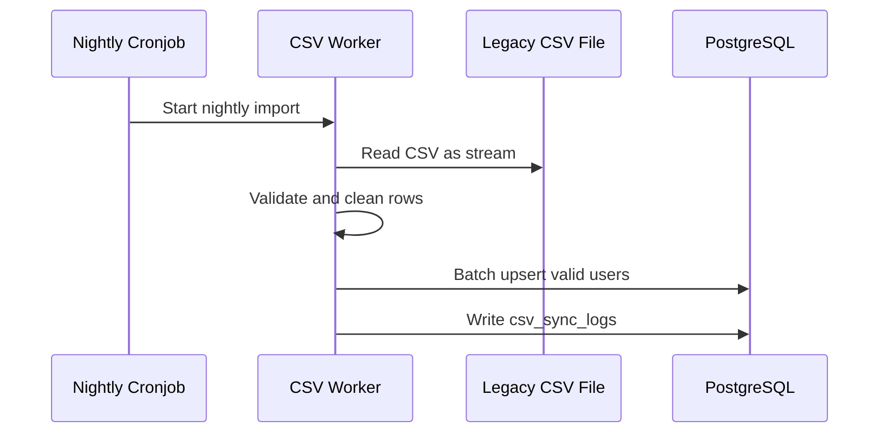

# Specification: CSV Data Synchronization (Legacy System ETL)

## Description
This feature imports student data from the legacy system using nightly CSV files.

The system does not call a legacy API. Instead, a scheduled job reads the file as a stream, validates each row, and writes valid records into PostgreSQL using batch upsert logic. Invalid rows are isolated so they do not stop the entire import.

## API Surface

| Method | Endpoint | Purpose |
|---|---|---|
| POST | `/admin/csv-sync/run` | Trigger a manual CSV import |
| GET | `/admin/csv-sync-logs` | View import logs |

## Main Flow

Step-by-step behavior:

1. A nightly scheduler starts the ETL job.
2. The worker reads the CSV file as a stream to avoid loading everything into memory.
3. The worker validates and cleans each row.
4. Valid rows are inserted or updated in PostgreSQL using batch upsert.
5. Import statistics and errors are written into `csv_sync_logs`.
6. The job finishes without stopping the live application.

## Error Scenarios

### 1. Corrupted or invalid rows
If some rows are malformed, the worker isolates them and continues with valid rows.

Expected behavior:

- Skip only the bad rows.
- Continue processing the rest of the file.
- Record row-level errors for review.

### 2. Duplicate student records
If the CSV contains duplicates, the worker should not create duplicate user accounts.

Expected behavior:

- Use unique constraints on student code and email.
- Upsert instead of blind insert.
- Log duplicate handling in the sync report.

### 3. Partial import failure
If the job is interrupted in the middle, the system must allow retry without corrupting existing data.

Expected behavior:

- Keep previously committed rows.
- Resume safely on the next run.
- Store failure details in `csv_sync_logs`.

## Constraints

| Constraint | Requirement |
|---|---|
| Execution mode | Nightly scheduled job |
| Memory usage | Read CSV as a stream, not as a full file in memory |
| Import strategy | Batch upsert |
| Failure handling | Error Isolation for invalid rows |
| Data integrity | Unique constraints must prevent duplicate users |
| Availability | Import must not block the live system |

## Acceptance Criteria

- The nightly job can import the file without crashing the server.
- Valid rows are upserted into PostgreSQL.
- Invalid rows are skipped and reported.
- Duplicate users are not created.
- The live application remains available during import.
