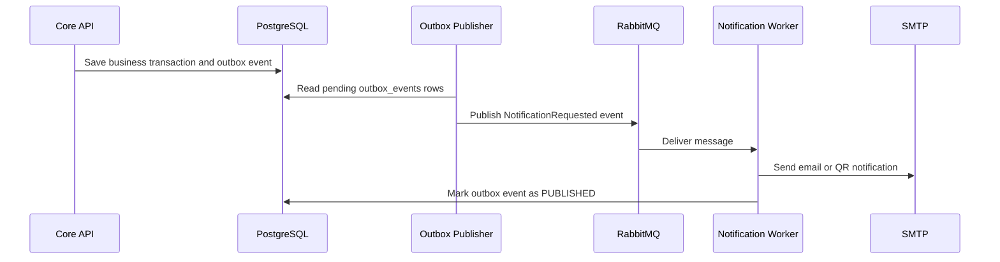

# Specification: Asynchronous Notification (Notification Worker)

## Description
This feature sends confirmation emails and QR-related notifications without slowing down the main registration flow.

The system uses the Transactional Outbox Pattern to safely record notification events in PostgreSQL and publish them to RabbitMQ later. A Notification Worker consumes those events and sends emails through SMTP.

## API Surface

| Method | Endpoint | Purpose |
|---|---|---|
| GET | `/notifications/me` | List my notifications |
| PATCH | `/notifications/{id}/read` | Mark a notification as read |
| POST | `/admin/notifications/replay` | Replay failed notifications |

## Main Flow

Step-by-step behavior:

1. The Core API completes the main business action, such as registration confirmation.
2. The system writes a notification event into the outbox table in PostgreSQL.
3. A separate outbox publisher reads pending events.
4. The outbox publisher sends the event to RabbitMQ.
5. The Notification Worker consumes the event and calls SMTP.
6. After the notification succeeds, the worker marks the event as published.

## Error Scenarios

### 1. RabbitMQ is down
If the broker is unavailable, the outbox event stays in PostgreSQL.

Expected behavior:

- Do not lose the notification intent.
- Retry publishing later.
- Keep the registration flow fast and independent.

### 2. SMTP fails
If the email provider returns an error, the worker retries according to the configured retry policy.

Expected behavior:

- Keep the event in a retryable state.
- Do not block the main application.
- Mark the event as failed only after retry exhaustion.

### 3. Duplicate delivery attempt
If the same event is processed more than once, the notification layer should avoid duplicate user-facing messages where possible.

Expected behavior:

- Use event identifiers to deduplicate processing.
- Preserve idempotent worker behavior.
- Ensure repeated delivery does not corrupt system state.

## Constraints

| Constraint | Requirement |
|---|---|
| Processing mode | Notifications must be asynchronous |
| Reliability | Notification intent must survive broker failures |
| Outbox pattern | Business data and event data must be stored atomically |
| Delivery target | Use RabbitMQ and SendGrid |
| Performance | Notification work must not slow down registration |
| Idempotency | Repeated events should not create inconsistent outcomes |

## Acceptance Criteria

- Registration completes without waiting for email delivery.
- Notification events are safely stored in the outbox.
- The worker can publish events later if RabbitMQ is temporarily unavailable.
- SendGrid failures do not crash the main API.
- Confirmation messages are delivered after the worker processes the event.
