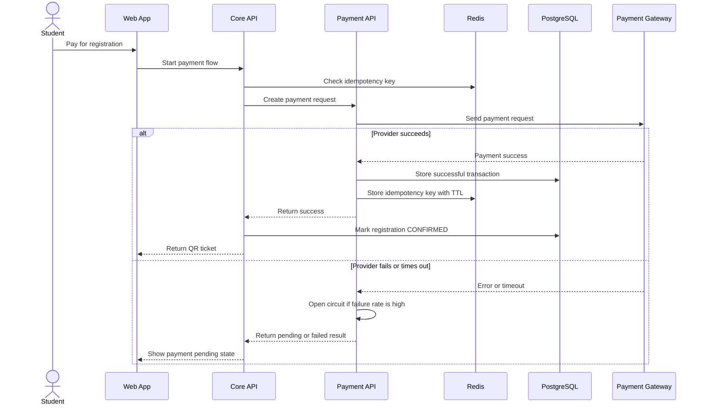

# Specification: Payment and Fault Tolerance (Payment Module)

## Description
This feature handles paid workshop checkout and protects the system from unstable payment gateway behavior.

The payment flow uses a Circuit Breaker to isolate repeated external failures. It also uses Idempotency Keys so that retries from the client or payment provider cannot charge the student twice.

## API Surface

| Method | Endpoint | Purpose |
|---|---|---|
| POST | `/payments` | Create a payment session |
| POST | `/payments/webhook` | Receive gateway callback |
| GET | `/payments/me` | View my payment history |
| GET | `/payments/{id}` | View one payment |

## Main Flow

Step-by-step behavior:

1. The student starts the payment from the registration screen.
2. The system checks the idempotency key in Redis.
3. The Payment API sends the request to the payment provider.
4. If the request succeeds, the payment is written to PostgreSQL and the registration is confirmed.
5. If the provider fails, the circuit breaker protects the rest of the system.
6. The student sees a pending or retry state instead of a system crash.

## Error Scenarios

### 1. Provider timeout
If the external gateway times out repeatedly, the circuit breaker opens.

Expected behavior:

- Stop sending new requests to the provider temporarily.
- Preserve browsing and registration features.
- Put the registration into `PENDING_PAYMENT`.

### 2. Duplicate retry
If the student retries the same payment request, the idempotency key prevents double processing.

Expected behavior:

- Return the previous result.
- Do not charge the student twice.
- Do not create duplicate payment records.

### 3. Recovery after outage
After the configured cooldown period, the circuit breaker enters Half-Open state and sends a small number of probe requests.

Expected behavior:

- Close the circuit if the provider recovers.
- Re-open the circuit if probe requests fail.
- Keep the user informed about payment status.

## Constraints

| Constraint | Requirement |
|---|---|
| Fault isolation | Payment failures must not break browsing or registration |
| Retry safety | Duplicate retries must not create duplicate charges |
| Circuit breaker | Closed / Open / Half-Open states must be implemented |
| Idempotency storage | Use Redis with a TTL |
| Consistency | Successful payments must update PostgreSQL exactly once |
| UX | The user must receive a clear pending or success response |

## Acceptance Criteria

- A successful payment produces exactly one confirmed registration.
- Duplicate retries do not result in double charges.
- The system opens the circuit after repeated provider failures.
- Non-payment features continue to work during payment outages.
- The payment state is correctly written to PostgreSQL on success.
