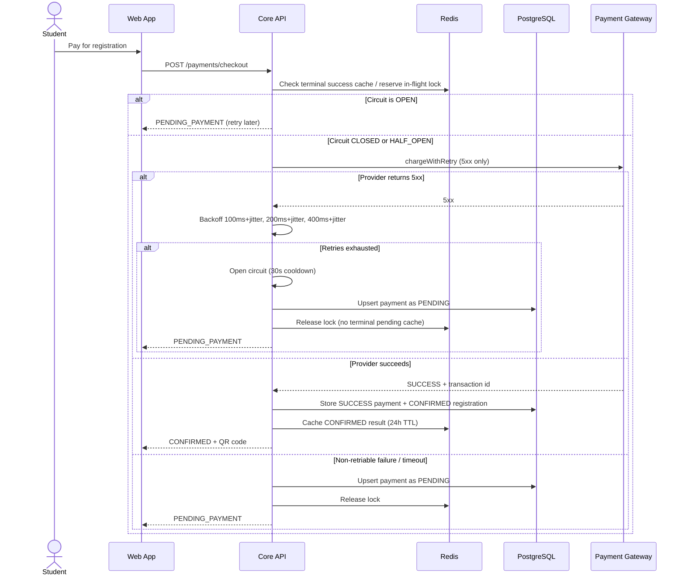

# Specification: Payment and Fault Tolerance (Payment Module)

## Description
This feature handles paid workshop checkout and protects the system from unstable payment gateway behavior.

The payment flow uses:
- **Exponential backoff with jitter** for temporary provider errors (HTTP 5xx)
- A **Circuit Breaker** (Closed / Open / Half-Open) to isolate repeated external failures
- **Idempotency keys** in Redis and PostgreSQL so retries from the client or payment provider cannot charge the student twice

Payment status lifecycle includes `PENDING`, `SUCCESS`, `FAILED`, and `REFUNDED` to support accounting and post-cancellation reconciliation. In the current implementation, gateway failures during checkout are persisted as `PENDING` and surfaced to the UI as `PENDING_PAYMENT` until a successful checkout or webhook confirmation.

## API Surface

| Method | Endpoint | Purpose |
|---|---|---|
| POST | `/payments/checkout` | Create a payment session (primary student UI path) |
| POST | `/payments` | Alias for checkout |
| POST | `/payments/webhook` | Receive gateway callback (signed with `x-webhook-secret`) |
| GET | `/payments/me` | View my payment history |
| GET | `/payments/{id}` | View one payment |

### Checkout request body

```json
{
  "registrationId": "b70ca1fa-8f06-4f53-8ad4-4d6f3b38e9f9",
  "idempotencyKey": "2b0a2c9d-9e6a-4db0-8e74-92b5d2e0c8e1"
}
```

Development-only field: `simulateResult` (`success`, `5xx`, `timeout`, `fail`, `pending`) for mocked gateway behavior.

## Main Flow



Step-by-step behavior:

1. The student starts payment from the registration dialog or **My Payments** (`Pay Now` for `PENDING` rows).
2. The client sends a stable UUID idempotency key for that checkout session.
3. The backend replays a cached **CONFIRMED** Redis result if the same key already succeeded.
4. If the circuit is open, the backend returns `PENDING_PAYMENT` immediately without calling the provider.
5. Otherwise the backend calls the gateway with 5xx retry/backoff, then writes PostgreSQL state.
6. On success, registration is confirmed, email side effects are enqueued, and the QR code is returned.
7. On failure, the student sees a pending/retry state instead of a system crash.

If a paid workshop is canceled, the system refunds successful payments and updates `payments.status` to `REFUNDED`.

## Error Scenarios

### 1. Provider 5xx (temporary outage)
If the external gateway returns repeated 5xx responses, the backend retries with exponential backoff and jitter before opening the circuit.

Expected behavior:

- Retry up to 3 times with delays of approximately 100 ms, 200 ms, and 400 ms (each plus jitter).
- After retries are exhausted, open the circuit for **30 seconds**.
- Preserve browsing and registration features.
- Keep registration in `PENDING_PAYMENT` and payment row in `PENDING`.
- Do not cache pending failure as a terminal idempotency result in Redis.

### 2. Provider timeout or non-retriable failure
Timeout and hard rejection are not retried with the 5xx backoff policy.

Expected behavior:

- Return `PENDING_PAYMENT` with a clear message.
- Allow the student to retry later with the same idempotency key.
- Do not open the circuit unless a 5xx retry sequence was exhausted.

### 3. Duplicate retry
If the student retries the same payment request after a successful checkout, the idempotency key prevents double processing.

Expected behavior:

- Return the previous `CONFIRMED` result from Redis or PostgreSQL.
- Do not charge the student twice.
- Do not create duplicate successful payment records.

### 4. Recovery after outage
After the configured cooldown period (**30 seconds**), the circuit breaker enters **Half-Open** and allows up to **3** probe requests.

Expected behavior:

- Transition to **Closed** if a probe succeeds.
- Transition back to **Open** if a probe fails.
- Return `PENDING_PAYMENT` with retry guidance while the circuit is open.

### 5. Workshop canceled after successful payment
If a workshop is canceled after students have already paid, the system must execute and record refunds.

Expected behavior:

- Trigger refund flow for successful payments (admin cancel workshop).
- Update `payments.status` to `REFUNDED`.
- Emit refund notification events for email and reconciliation pipelines.

## Frontend behavior

| Surface | Behavior |
|---|---|
| Student registration dialog | Paid workshops show checkout with stable idempotency key |
| My Payments list | `PENDING` payments show **Pay Now** |
| Payment detail modal | Shows status-specific explanation for the current payment (`PENDING`, `SUCCESS`, `FAILED`, `REFUNDED`) |

## Configuration

| Variable | Default | Purpose |
|---|---|---|
| `PAYMENT_IDEMPOTENCY_TTL_SECONDS` | `86400` | Redis TTL for successful replay cache |
| `PAYMENT_RETRY_DELAYS_MS` | `100,200,400` | 5xx backoff delays |
| `CIRCUIT_BREAKER_OPEN_DURATION_MS` | `30000` | Open-state cooldown |
| `CIRCUIT_BREAKER_HALF_OPEN_PROBES` | `3` | Max probe attempts in half-open |
| `WEBHOOK_SECRET` | — | Required header `x-webhook-secret` for `/payments/webhook` |
| `REDIS_HOST`, `REDIS_PORT`, `REDIS_PASSWORD` | local Docker defaults | Idempotency + circuit breaker state |

## Constraints

| Constraint | Requirement |
|---|---|
| Fault isolation | Payment failures must not break browsing or registration |
| Retry safety | Duplicate retries must not create duplicate charges |
| Circuit breaker | Closed / Open / Half-Open states must be implemented |
| Gateway retry | 5xx errors use exponential backoff with jitter before opening the circuit |
| Idempotency storage | Redis for in-flight lock + terminal success cache; PostgreSQL for durable payment rows |
| Consistency | Successful payments must update PostgreSQL exactly once |
| Refund traceability | Refunded transactions must be represented by `payments.status = REFUNDED` |
| UX | The user must receive a clear pending or success response |

## Acceptance Criteria

- A successful payment produces exactly one confirmed registration.
- Duplicate retries do not result in double charges.
- 5xx provider failures are retried with backoff before the circuit opens.
- The system opens the circuit after exhausted 5xx retries and cools down for 30 seconds.
- Half-open probes close the circuit on success and re-open on failure.
- Non-payment features continue to work during payment outages.
- Pending checkout failures do not block later retries via stale Redis replay.
- The payment state is correctly written to PostgreSQL on success.
- Canceled paid workshops generate refund records with status `REFUNDED`.

## Implementation notes (current codebase)

- Checkout logic: `src/backend/services/payment.service.js`
- Gateway retry simulation: `src/backend/services/payment-gateway.service.js`
- Circuit breaker: `src/backend/services/circuit-breaker.service.js`
- Idempotency: `src/backend/services/idempotency.service.js`
- Refunds on workshop cancel: `src/backend/services/refund.service.js`
- Student UI: `src/frontend/src/pages/student/StudentPaymentsPage.jsx`, `PaymentDetailModal.jsx`
