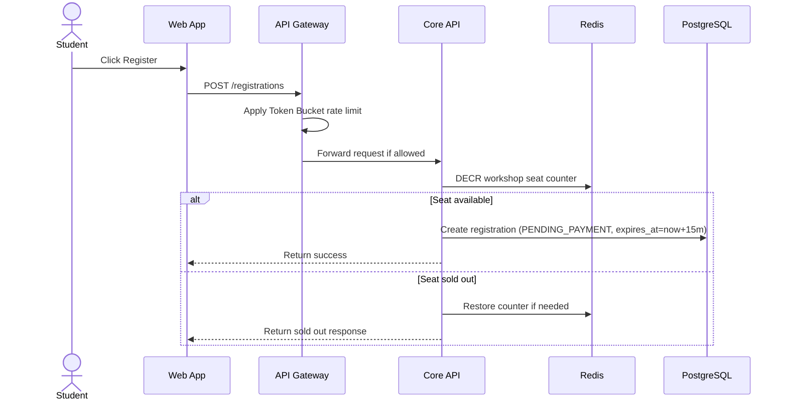

# Specification: Registration and Seat Contention (Registration & Concurrency Control)

## Description
This feature handles workshop registration under heavy traffic and prevents overselling when many students compete for the same limited seats.

The API Gateway limits request bursts using Token Bucket rate limiting. The Core API reserves seats atomically in Redis using the `DECR` command before it writes the registration into PostgreSQL.

For paid registrations, the system sets `registrations.expires_at` (for example, now + 15 minutes) while status is `PENDING_PAYMENT`. A background cleanup job cancels expired holds and restores seat availability.

## API Surface

| Method | Endpoint | Purpose |
|---|---|---|
| POST | `/registrations` | Create a registration |
| GET | `/registrations/me` | List my registrations |
| GET | `/registrations/{id}` | View registration details |

## Main Flow

Step-by-step behavior:

1. The student clicks Register.
2. The API Gateway checks request frequency using Token Bucket.
3. If the request is allowed, the Core API reserves one seat in Redis using `DECR`.
4. If a seat is available, the Core API writes the registration into PostgreSQL.
5. The student receives a success response.
6. If no seat remains, the system returns a sold-out response immediately.

When a pending payment is not completed before `expires_at`, a cron worker marks the registration as `CANCELLED` and releases the reserved seat.

## Error Scenarios

### 1. Too many requests
If the traffic exceeds the configured threshold, the Gateway blocks the request before it reaches the Core API.

Expected behavior:

- Return HTTP 429 Too Many Requests.
- Prevent connection pool exhaustion.
- Keep the system fair for all students.

### 2. Redis reservation fails
If Redis is unavailable or the counter operation fails, the system must not oversell seats.

Expected behavior:

- Reject the registration request.
- Do not write a partial registration.
- Log the error for operational follow-up.

### 3. PostgreSQL write fails after seat reservation
If Redis successfully reserves a seat but PostgreSQL cannot store the registration, the system must recover the seat count.

Expected behavior:

- Compensate the Redis counter.
- Return an error response.
- Keep the seat availability consistent.

### 4. Pending payment expired
If payment is not completed before `registrations.expires_at`, the pending reservation must not block seats indefinitely.

Expected behavior:

- A scheduled job finds expired `PENDING_PAYMENT` rows.
- The job marks them `CANCELLED`.
- The system restores seat counters and emits an audit/event record.

## Constraints

| Constraint | Requirement |
|---|---|
| Peak load | Support 12,000 requests in the first 10 minutes |
| Concurrency | Prevent two students from claiming the final seat |
| Rate limiting | Use Token Bucket at the Gateway |
| Atomic reservation | Use Redis `DECR` for seat reservation |
| Consistency | Restore the seat counter on failure |
| Hold expiration | `registrations.expires_at` must be set for pending payment holds |
| Fairness | Avoid request flooding from a small number of clients |

## Acceptance Criteria

- The system returns HTTP 429 when the burst limit is exceeded.
- A seat can never be oversold.
- The final seat cannot be assigned to two students.
- Failed PostgreSQL writes do not leave the Redis counter inconsistent.
- Expired `PENDING_PAYMENT` registrations are canceled automatically and seats are released.
- Registration remains responsive during traffic spikes.
