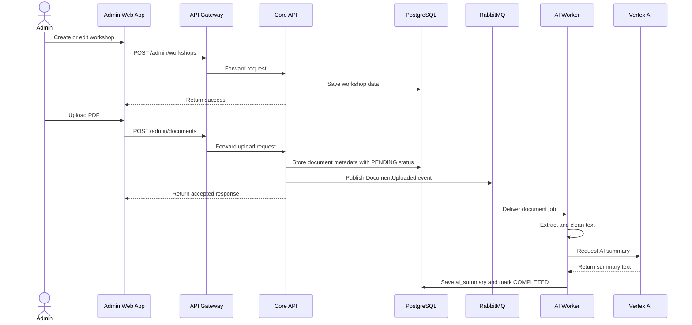

# Specification: Event Management and AI Summary (Workshop Management)

## Description
This feature allows the Organizing Committee to create, update, cancel, and manage workshops, including uploading PDF documents that will be summarized by AI.

The PDF summary flow is asynchronous. The Core API stores the document metadata and publishes an event to RabbitMQ. The AI Worker then extracts the PDF content and calls Vertex AI to generate the summary.

## Main Flow

Step-by-step behavior:

1. The admin creates or updates workshop data through the web interface.
2. The Core API stores the workshop in PostgreSQL.
3. When a PDF is uploaded, the Core API creates a document record with `PENDING` status.
4. The Core API publishes an event to RabbitMQ.
5. The AI Worker consumes the event, extracts text, and sends it to Vertex AI.
6. The summary is written back to PostgreSQL.
7. The workshop detail page displays the completed summary.

## Error Scenarios

### 1. Invalid file upload
If the uploaded file is not a PDF or exceeds the size limit, the Core API rejects it immediately.

Expected behavior:

- No database record is created.
- No event is sent to RabbitMQ.
- The admin receives a validation error.

### 2. RabbitMQ unavailable
If the event cannot be published, the metadata must still be preserved.

Expected behavior:

- Store the document record in PostgreSQL.
- Persist the event in the outbox.
- Publish it later when the broker is available.

### 3. Vertex AI timeout
If Vertex AI is slow or unavailable, the worker retries the request.

Expected behavior:

- The main web request is not blocked.
- The document stays in `PROCESSING` or `PENDING`.
- After retry failure, the status becomes `FAILED`.

## Constraints

| Constraint | Requirement |
|---|---|
| Processing mode | AI summary generation must be asynchronous |
| File handling | Large PDFs must not block the API thread |
| Reliability | Metadata must survive broker or AI failures |
| Status tracking | Use `PENDING`, `PROCESSING`, `COMPLETED`, and `FAILED` |
| Security | Only admins can upload workshop documents |
| UX | The admin must get an immediate accepted response |

## Acceptance Criteria

- An admin can upload a valid PDF and receive an immediate response.
- The AI summary is processed by a background worker.
- The summary appears on the workshop detail page after processing.
- Large PDFs do not crash or freeze the main API.
- Broker or AI failures do not delete upload metadata.
